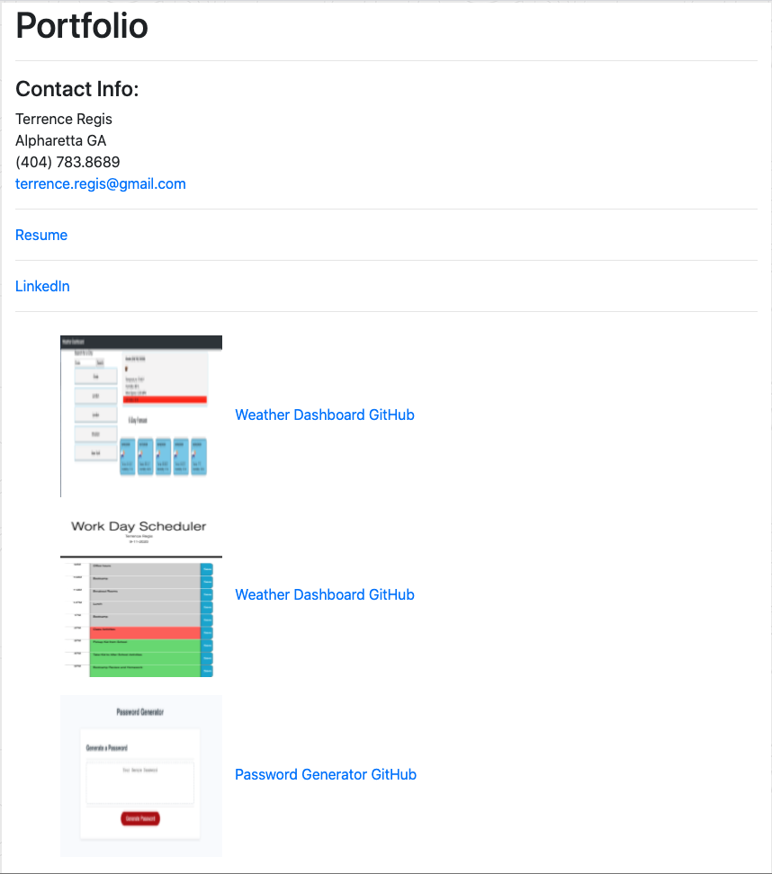

# Updated-Professional-Profile

Description: This project updates the profession profile assigment to add resume, linkedin profile github project and the like.
Link: https://tregis-cloud.github.io/Updated-Professional-Profile/

Usage: accessing the website, you will get the About page which tells you a little bit about me along with my profile. From the About page, you can navigate using the menu bar to the Portfolio page or the Contact page. On the Portfolio page, you will see smy contact info, link to my resume, linked in profile, and several projects that I have done so far and one in progress. From the portfolio page you can navigate to the Contact or About pages. The Contact page allows you to enter your name, email and a brief message, if you want me to get intouch with you. From the contact page you can navigate to the About or Portfolio pages.

Test: 1. Access site, you should be on the landing page. Verify photo and text. (Successful) 2. Click link to the portfolio page. Verify that you go to the Portfolio page and all links resolved to the correct pages. (Successful) 3. Click link to Contact page. Verify that you can see and enter a name, an email address and a message. (Successful)
